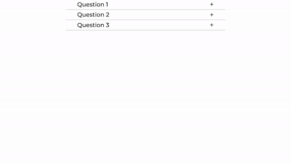
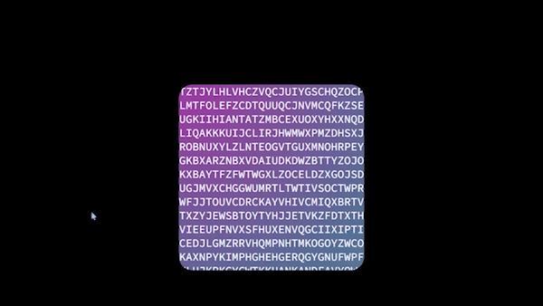

# 3️⃣0️⃣ days, 3️⃣0️⃣ web applications (Vanilla JS)

 

✅ A **30-day challenge** to code every day and make something "interesting" 🌟

✅ I tried to make **unique** projects rather than what you've all seen online (To-Do lists, Calculators, etc) 💠

✅ All the projects are **documented** 📃, Feel free to fork the code and make changes or do the **challenge yourself** 💪, Either these projects or your own ideas 

✅ I try to build at least two projects for each important topic in JS (APIs, DOM Manipulation, Async, etc)

---

### Tech stack used in these projects: 💻
> HTML  
> Vanilla CSS  
> Vanilla JS  

---

### Project list: 🏆 
>**Live Preview** will be added soon for all the projects :-)

1. Weather App
> This app gets the user's latitude and longitude (if they allow it in their browser) and based on that it gets the data from [this API](https://open-meteo.com/).  
> Key Skills: Async operations / APIs

---

2. Flexbox CSS Generator
> This app helps you understand/use Flexbox CSS. By changing the values, The result will be visualized and you can see the exact code used for that result.  
> Key Skills: DOM Manipulation / Flexbox

---

3. Accordion Menu
> Just a simple accordion menu   
> Key Skills: DOM Manipulation

---

4. Magnetic Hover Effect
> A custom cursor with a magnetic effect toward icons. The cursor changes its shape while hovering over the icons.  
> Key Skills: Working with GSAP / Working with mouse and handling its events

---

5. Filter Menu
> A simple item filter.  
> Key Skills: DOM Manipulation / Logic behind filters

---

6. Encoding Mouse Hover Effect
> When you hover the container, It generates some random letters in a container and a gradient follows the mouse.  
> Key Skills: Mouse events in JS, Gradients in CSS, Masks in CSS.  
> Although this was a simple small project, It led me to a rabbit whole of CSS properties that I knew very little about. Also understanding mouse events better was good.

---

7. Music Player
> A simplistic music player, You can move forward/backward each track. Changing the song updates the title, artist, and cover art.  
> Key Skills: Working with audio in JS  
> Musics in this project by [LHSchiptunes](https://www.youtube.com/@LHSchiptunes)

---

8. ?
