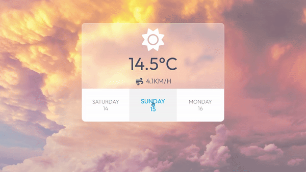
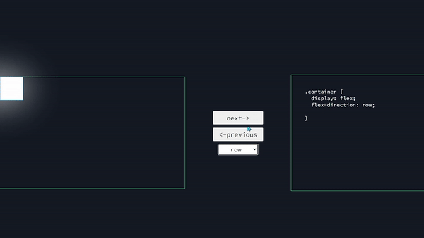
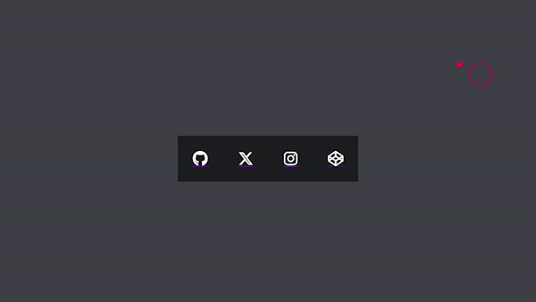
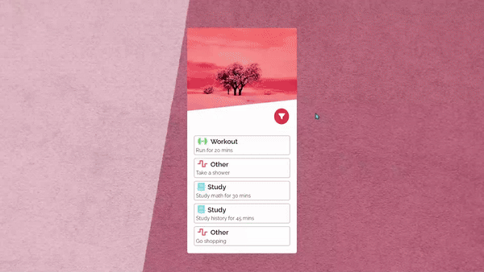
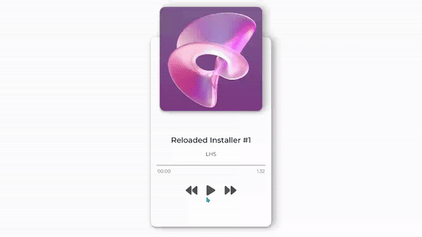

# Vanilla JS Projects 🔥

 

✅ All the projects are **documented** 📃, Feel free to fork the projects and make changes

---

### Tech stack used in these projects: 💻
> HTML  
> Vanilla CSS  
> Vanilla JS  

---

### Project list: 🏆 
>**Live Preview** will be added soon for all the projects :-)

1. Weather App
> This app gets the user's latitude and longitude (if they allow it in their browser) and based on that it gets the data from [this API](https://open-meteo.com/).  
> Key Skills: Async operations / APIs

---

2. Flexbox CSS Generator
> This app helps you understand/use Flexbox CSS. By changing the values, The result will be visualized and you can see the exact code used for that result.  
> Key Skills: DOM Manipulation / Flexbox

---

3. Magnetic Hover Effect
> A custom cursor with a magnetic effect toward icons. The cursor changes its shape while hovering over the icons.  
> Key Skills: Working with GSAP / Working with mouse and handling its events

---

4. Filter Menu
> A simple item filter.  
> Key Skills: DOM Manipulation / Logic behind filters

---

5. Music Player
> A simplistic music player, You can move forward/backward each track. Changing the song updates the title, artist, and cover art.  
> Key Skills: Working with audio in JS  
> Music in this project by [LHSchiptunes](https://www.youtube.com/@LHSchiptunes)

---

6. ?
