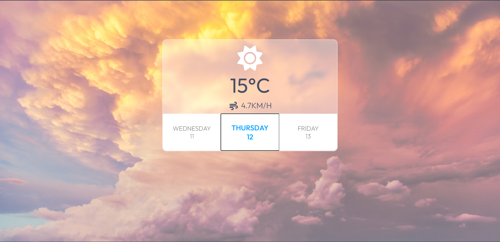
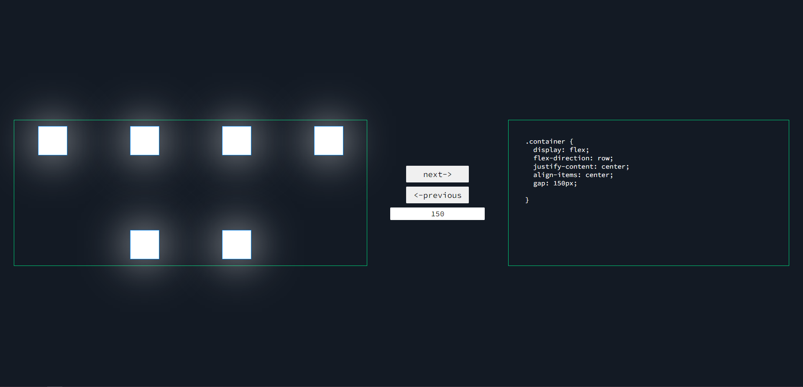

# 3️⃣0️⃣ days, 3️⃣0️⃣ web applications (Vanilla JS)

 

✅ A **30-day challenge** to code every day and make something "interesting" 🌟

✅ I tried to make **unique** projects rather than what you've all seen online (To-Do lists, Calculaters, etc) 💠

✅ All the projects are **documented** 📃, Feel free to fork the code and make changes or do the **challenge yourself** 💪, Either these projects or your own ideas 

---

### Tech stack used in these projects: 💻
> HTML  
> Vanilla CSS  
> Vanilla JS  

---

### Project list: 🏆 
>**Live Preview** will be added soon for all the projects :-)

1. Weather App
> This app gets the user's latitude and longitude (if they allow it in their browser) and based on that it gets the data from [this API](https://open-meteo.com/).
> Key Skill: Async operations and promises, Working with APIS

  
 

---

2. Flexbox CSS Generator
> This app helps you understand/use flexbox css. By changing the values, The result will be visualized and you can see the exact code used for that result.
> DOM Manipulation, Flexbox

---
